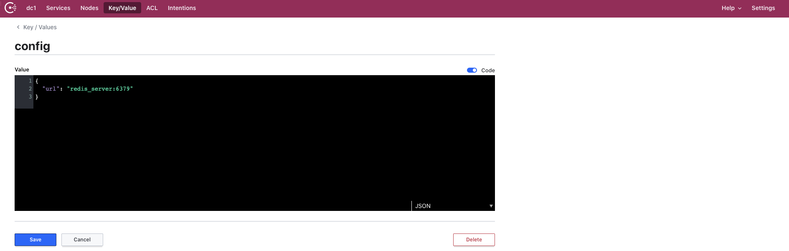

# Go-redis

Github: [https://github.com/golang-collection/Go-redis](https://github.com/golang-collection/Go-redis)

本项目为redis的RPC远程调用接口，通过GRPC实现。

# 目录结构
```
- client 客户端
- config 
  - config.go  通过viper读取consul的配置
  - consul.go  配置consul的常量
- dependence 通过docker-compose一键启动需要的依赖
- operation 封装redis的常用操作
- pool 封装redis的连接池
- proto 定义proto文件
- server 封装server端对外提供的服务
- docker-compose.yml 用于启动项目的docker-compose文件
- Dockerfiel 用于生成镜像的Dockerfile文件
- main.go 用于生成RPC的server端
- Makefile 用于执行make命令的Makefile文件，用于格式化代码并生成server端在linux下的可执行文件
```

# Quick start
```bash
git clone git@github.com:golang-collection/Go-redis.git
make
docker network create -d bridge redis_net
cd dependence
docker-compose up -d
```
以上命令会启动redis服务与consul服务，其中consul可以通过`localhost:8500`进行访问，在其key/value中创建config并配置如下



然后回到项目的根目录，执行以下命令即可启动redis的GRPC服务。

```bash
docker-compose up -d
```

在client端可以启动对应的客户端执行操作。

# 如何生成proto对应的文件
```bash
go get github.com/golang/protobuf/{proto,protoc-gen-go}
go get github.com/micro/protoc-gen-micro
cd proto
protoc --proto_path=. --micro_out=. --go_out=. redis.proto
```

# 注意
本项目是通过go-micro的方式将其封装为了微服务，但是个人认为对于一个单独的redis来说不应该将其封装为微服务，微服务的划分应该是从业务的角度出发。

# License

[MIT](./LICENSE)

Copyright (c) 2020 Knowledge-Precipitation-Tribe